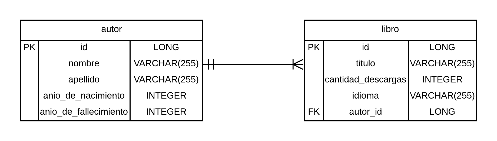
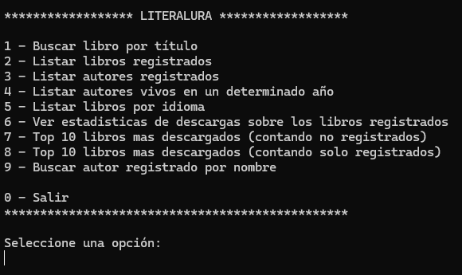
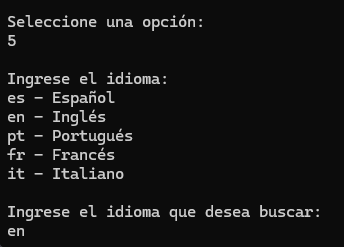
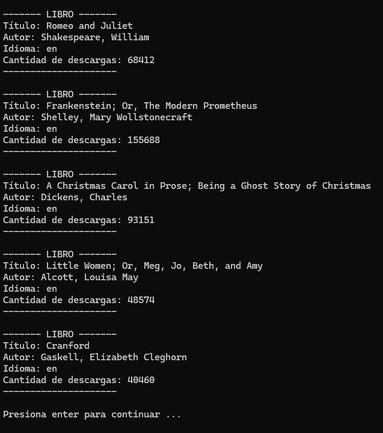
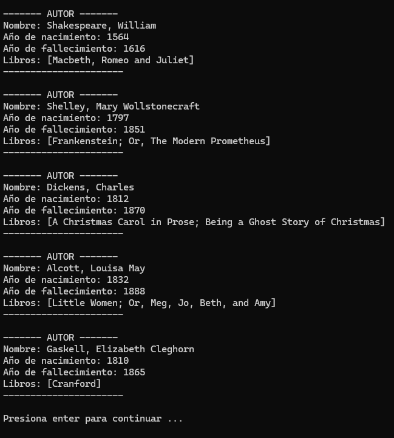
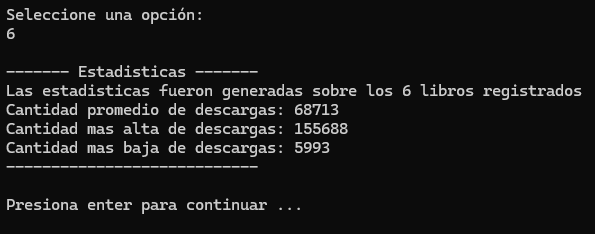

# LiterAlura 📚✨

LiterAlura es una aplicación de consola desarrollada en Java para utilizar los conocimientos adquiridos en el curso de Java y Spring de ONE (Oracle Next Education). \
Esta aplicación permite interactuar con un catálogo de libros, utilizando datos obtenidos de la API de [Gutendex](https://gutendex.com/). Este proyecto combina habilidades de consumo de APIs, manejo de datos JSON y persistencia en bases de datos, todo dentro del entorno de Java.

## Tabla de Contenidos 📚

1. [Descripción](#descripción-💡)
2. [Características](#características-✨)
3. [Requisitos Previos](#requisitos-previos-✅)
4. [Instalación y Configuración](#instalación-y-configuración-⚙️)
5. [Opciones del Menú Principal](#opciones-del-menú-principal-📋)
6. [Base de Datos](#base-de-datos-🛢️)
7. [Tecnologías Utilizadas](#tecnologías-utilizadas-🛠️)
8. [Ideas de Imágenes](#ideas-de-imágenes-🖼️)
9. [Contribuciones](#contribuciones-🙌)

## Descripción 💡

**LiterAlura** es una aplicación de consola que permite:

- Buscar libros por título a través de la API de Gutendex.
- Guardar libros y autores en una base de datos PostgreSQL.
- Consultar información almacenada sobre libros y autores.
- Generar estadísticas, como el top 10 de libros más descargados.
- Filtrar resultados por idioma, autores vivos en un año determinado, y más.

---

## Características ✨

- Consumo de datos desde la API de Gutendex.
- Menú interactivo con 9 opciones principales y un submenú (idiomas).
- Funcionalidad de guardar y consultar libros y autores en una base de datos PostgreSQL.
- Generación de estadísticas sobre descargas de libros.
- Filtrado avanzado por idioma, año y otros criterios.
- Persistencia y consulta eficiente utilizando JPA Hibernate.

---

## Requisitos Previos ✅

Antes de ejecutar el proyecto, asegúrate de tener instalados:

- **Java 17** o superior.
- **PostgreSQL** (configurado con una base de datos para el proyecto).
- **Maven** para gestionar dependencias.

---

## Instalación y Configuración ⚙️

1. **Clona el repositorio:**

   ```bash
   git clone https://github.com/LucianoNicolasArrieta/challenge-literalura
   ```

2. **Configura la base de datos en PostgreSQL:**

   - Crea una base de datos llamada `literalura`.
   - Configura las credenciales de acceso en el archivo `application.properties` (URL, user y password).

3. **Construye el proyecto:**

   ```bash
   mvn clean install
   ```

4. **Ejecuta la aplicación:**

   ```bash
   mvn spring-boot:run
   ```

---

## Opciones del Menú Principal 📋

1. **Buscar libro por título**: Realiza una búsqueda en la API de Gutendex, en caso de encontrarlo se guarda en la base de datos y se muestra en consola el libro guardado.
2. **Listar libros registrados**: Consulta los libros guardados en la base de datos.
3. **Listar autores registrados**: Consulta todos los autores en la base de datos.
4. **Listar autores vivos en un determinado año**: Filtra autores vivos en un año específico.
5. **Listar libros por idioma**: Submenú para buscar por idiomas como `es`, `en`, `pt`, `fr`, `it`.
6. **Ver estadísticas de descargas**: Muestra estadísticas generales sobre los libros registrados.
7. **Top 10 libros más descargados (no registrados)**: Consulta los más populares en la API externa.
8. **Top 10 libros más descargados (registrados)**: Consulta los libros más descargados en la base de datos.
9. **Buscar autor registrado por nombre**: Busca un autor en la base de datos por su nombre.

---

## Base de Datos 🛢️

El proyecto utiliza PostgreSQL para almacenar información sobre las entidades Libros y Autores. \
A continuación se muestra el Diagrama Entidad-Relacion (DER) del sistema:



---

## Tecnologías Utilizadas 🛠️

- **Java 17**
- **Spring Boot**
  - Spring Data JPA
  - Spring Web
- **PostgreSQL**
- **Maven**
- **Jackson** para procesar JSON.
- **Postman** para probar consultas en la API externa.

---

## Ideas de Imágenes 🖼️

Algunas imagenes de la aplicación corriendo en la consola:







---

Gracias por tomarte el tiempo de ver este proyecto! 😊✨
